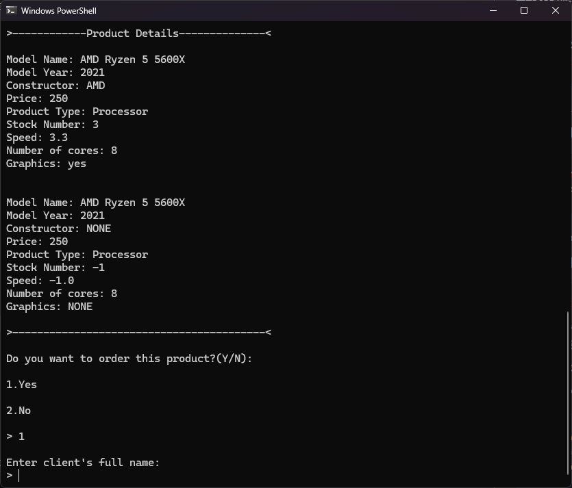

# Hardware-shop-operator

A cli tool for managing a virtual shop selling computer hardware


## Capabilities:

-
-
-

## Installation

1. Download the project directories
2. Move the .txt input file in the src directory
3. Ensure java and javac is installed
4. Compile all files
5. Run the mainApp java file to start the app 

```bash
  java mainApp
```

## Screenshots



